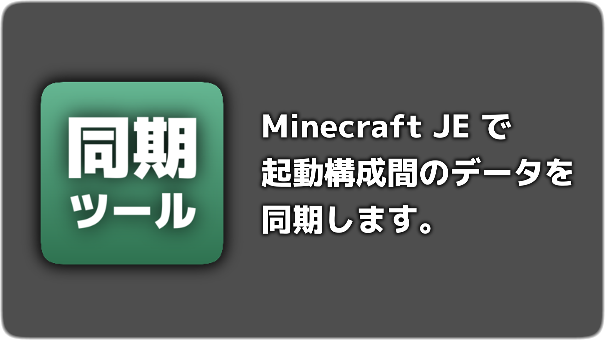
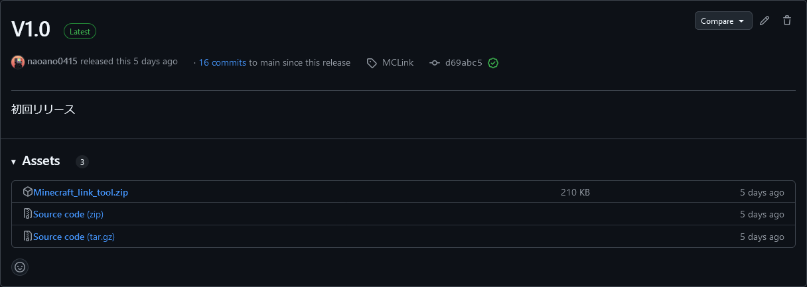
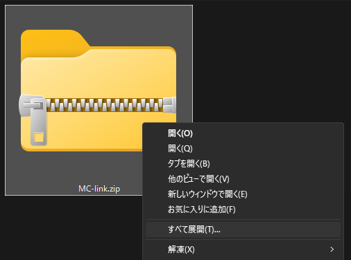
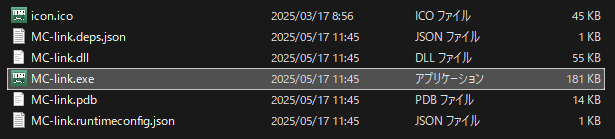
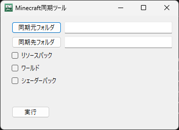
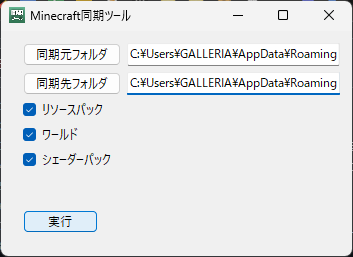

# MC Link 

Minecraft Java Editionの起動構成のデータを同期します。  
PrismLauncherでリソースパック等が分かれるのがめんどくさかったので作りました。
[公式サイト](https://naoano0415.github.io/Minecraft_link_tool/)
## ダウンロード
[release](https://github.com/naoano0415/Minecraft_link_tool/releases/tag/MCLink)

## 同期されるもの
- ワールドデータ
- リソースパック
-  シェーダーパック(optifine,Iris)
## 使い方
- [release](https://github.com/naoano0415/Minecraft_link_tool/releases/tag/MCLink)からzipファイルをダウンロード
  
- zipファイルを展開  
  
- 中にあるexeファイルを実行  
  
- 同期元フォルダ・同期先フォルダを設定する  
  
<pre>
<b>FolderName</b>
├── saves
├── resourcepacks
└── shaderpacks
</pre>  
  FolderNameの部分を選択する
- 同期するものを選択し、実行をクリック  
  <b>※同期先フォルダのデータは削除されます※</b>  
    
